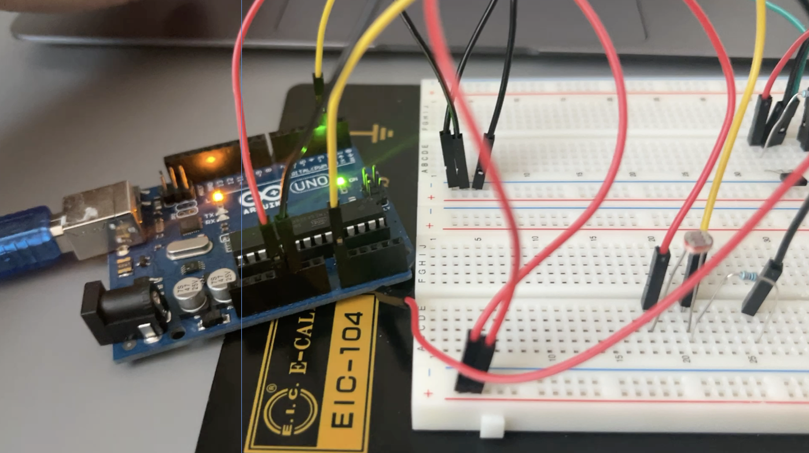
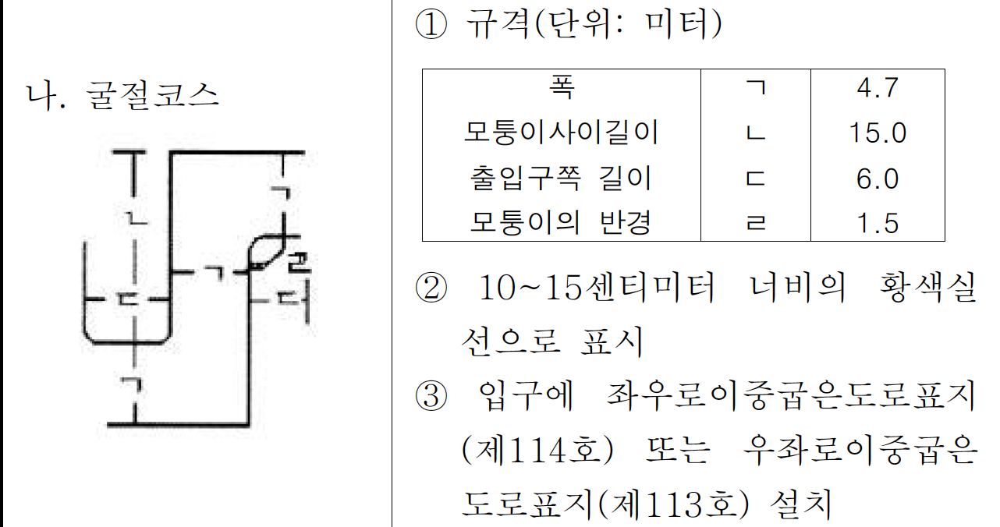
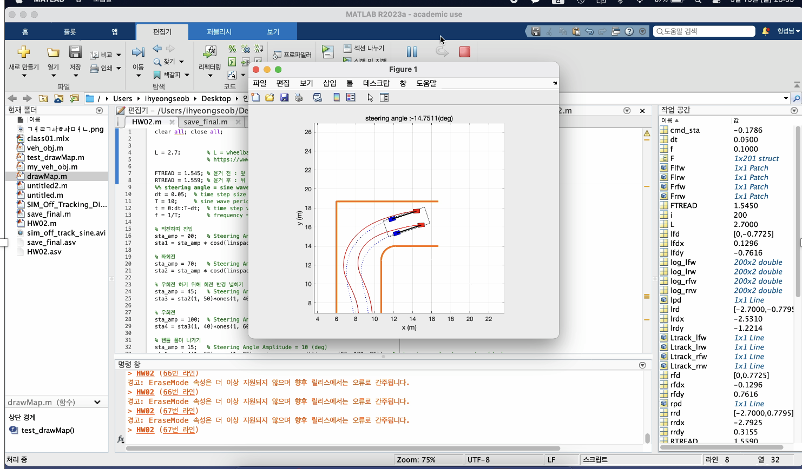
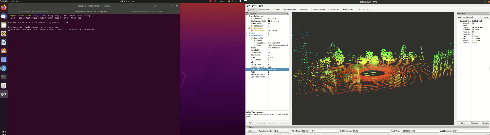
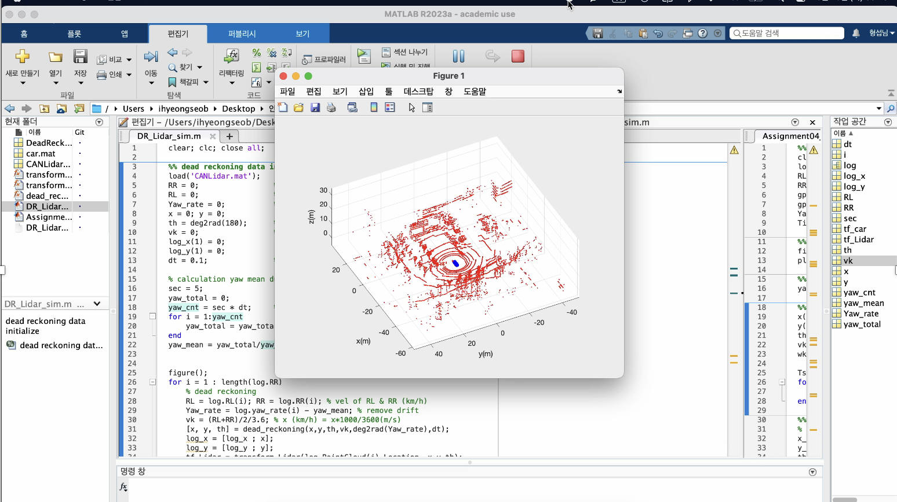
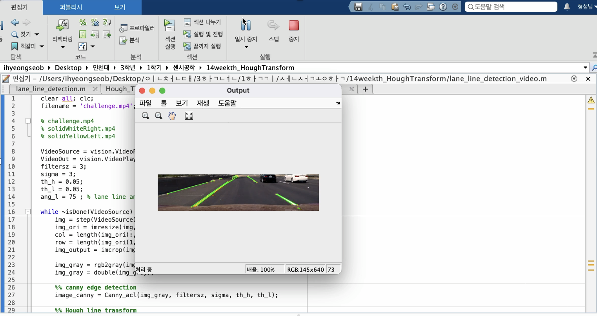

# 3-1_SensorAndActuator

velog 정리 : https://velog.io/@hseop/series/3-1-%EC%84%BC%EC%84%9C%EA%B3%B5%ED%95%99

* `HW_01/` : Practice with ultrasound sensor and hall sensor using Arduino.
  
* `HW_02/` : Bicycle model simulation using Matlab
  * 면허시허험장 굴절코스을 Matlab 으로 연석은 실선으로 나타내고 차량 모델의 바퀴가 실선을 넘어가지 않도록 주행시키는 simulation을 수행
      
* `HW_03/` : Drawing a driving map around the school using Lidar sensor data.
    
* `HW_04` : Assuming the exact method as the ground truth, we will plot and analyze graphs of errors in x, y, velocity, and theta for Euler and Runge-Kutta Dead Reckoning results.
  
* `HW_05` : Lane line detection using Canny edge detection.
